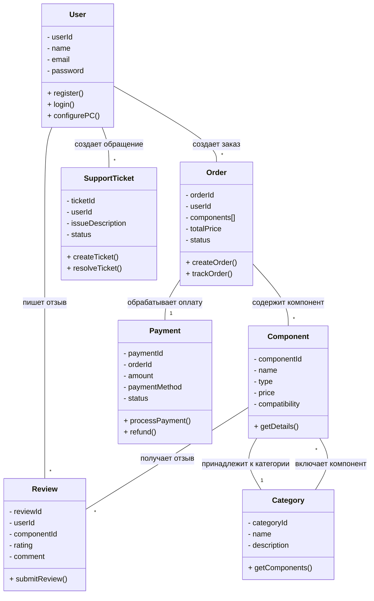
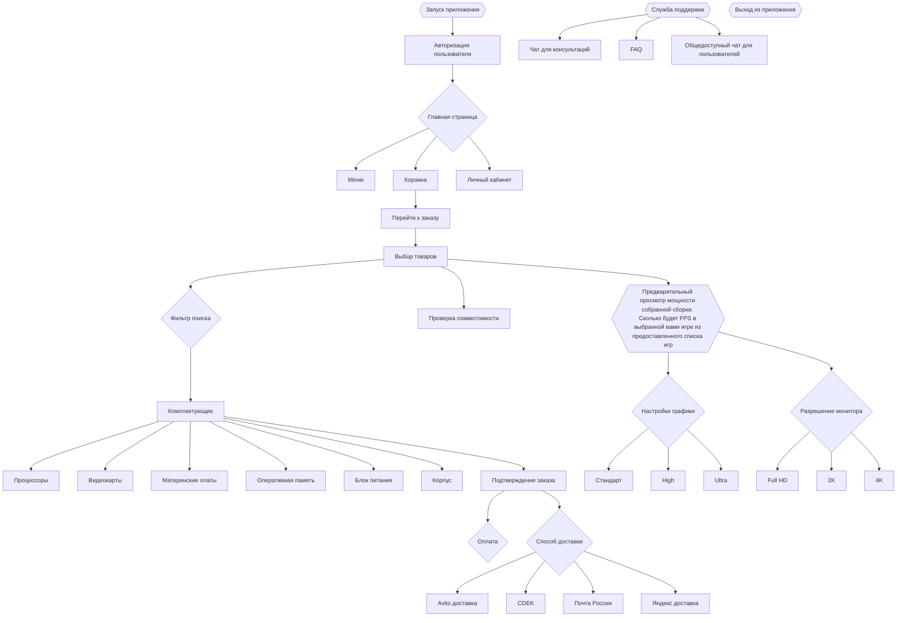
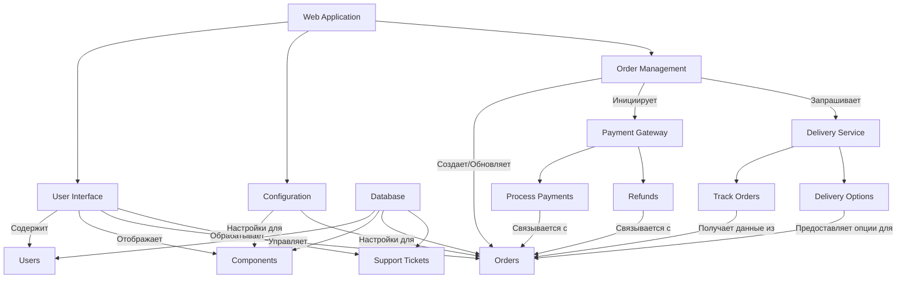

Тема: Конфигуратор ПК на заказ с доставкой  
====

Причина разработки 
----

С каждым годом растёт интерес к персонализированным компьютерам, которые могут быть адаптированы под специфические нужды пользователей — будь то игры, работа с графикой или программирование. Однако многие люди сталкиваются с трудностями при выборе комплектующих и сборке ПК. Проект "ПК на заказ с доставкой" призван упростить этот процесс, предоставляя пользователям удобный онлайн-конфигуратор, который поможет им выбрать оптимальные компоненты для их задач и доставить готовый компьютер прямо к двери.  
----

Требования к проекту  
1. Интерфейс конфигуратора:  
  - Удобный и интуитивно понятный интерфейс.  
  - Фильтр поиска для упрощененной подборки комплектующих под собственный бюджет.  
  - Возможность выбора различных комплектующих (процессоры, видеокарты, материнские платы и т.д.).  
    - процессоры  
       - AMD  
       - Intel  
    - видеокарты  
        - RX  
        - RTX  
        - GTX  
    - материнские платы  
    - опертивная память (кол-во плашек)  
    - БП  
    - корпус  
        - дефолт от самой компании  
        - дефолт от другой компании  
        - кастомный  
    - охлаждение процессора  
        - дефолт башня (кулер)  
        - водянка  
    - накопитель  
        - ЖД  
        - SSD  
        - M2  
  - Информация о совместимости компонентов.  
  - Шкала игротестов, демонстрирующая целеком FPS в играх (более 250 вариантов выбора игр для просмотра FPS'а). Также для упрощения добавлена функция выбора, чтобы понять какой будет FPS при вариативности:  
      - Внутренняя настройка графики в игре  
        - Standart  
        - High  
        - Ultra  
      - На каком мониторе именно будет все происходить  
        - Full HD  
        - 2K  
        - 4K  

2. База данных:  
  - Обновляемая база данных комплектующих с актуальными ценами и характеристиками.  
  - Возможность добавления новых товаров и удаления устаревших.  

3. Система заказов:  
  - Функционал для оформления заказа и выбора способа доставки.  
  - Поддержка различных методов оплаты (карты, электронные кошельки).  

4. Служба поддержки:  
  - Чат или телефонная линия для консультаций по выбору комплектующих.  
  - FAQ для решения распространённых вопросов.
  - Общественный чат (форум) на котором люди общаются, помогая друг другу ответами на вопросы (к примеру подборка сборки в определнный бюджет)  

5. Логистика:  
  - Выбор доставки  
     - Avito доставка  
     - CDEK  
     - Яндекс доставка  
     - Почта России  
  - Налаженная система доставки готовых ПК.  
  - Возможность отслеживания статуса заказа по номеру трекера.  

6. Безопасность:  
  - Защита пользовательских данных и информации о платежах.  
  - Соответствие стандартам безопасности и конфиденциальности.  

7. Маркетинг:  
  - Разработка стратегии продвижения проекта (социальные сети, реклама, партнерства).  
    - социальные сети  
    - реклама
    - партнерства
  - Создание контента для привлечения целевой аудитории (обзоры, гайды, ролик в колабе с медийкой).
    - обзоры
    - гайды
    - ролик в колабе с медийкой
----

Диаграмма классов  

Демонстрация структурной системы для веб-приложения, связанного с конфигурацией и заказом компьютерных комплектующих.  
- Пользователь может создавать множество заказов, тикетов в поддержку и отзывов.  
- Заказ может содержать множество компонентов и связан с одним платежом.  
- Компонент может иметь множество отзывов и принадлежит к одной категории.  
- Категория может включать множество компонентов.  

----

Диаграмма Активностей  

Описание последовательности действий пользователя в веб-приложении, включая выбор товаров, оформление заказа и доступ к службе поддержки.  

----

Диаграмма компонентов  

Здесь иллюстрируется, как различные компоненты приложения связаны друг с другом и как они обрабатывают данные пользователей и заказы.  
- UI управляет и отображает данные из базы данных.  
- Конфигурация влияет на настройки компонентов и заказов.  
- Управление заказами инициирует процессы платежей и запросы к службе доставки.  
- Платежная система и служба доставки взаимодействуют с заказами для их обработки и отслеживания.  

